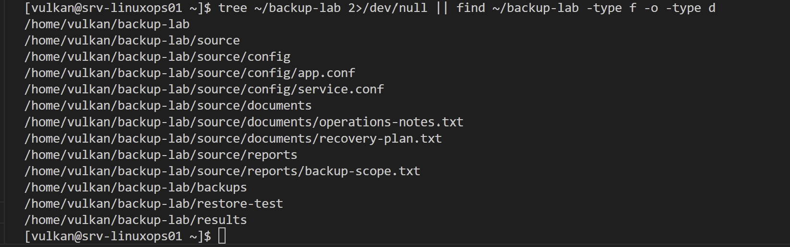
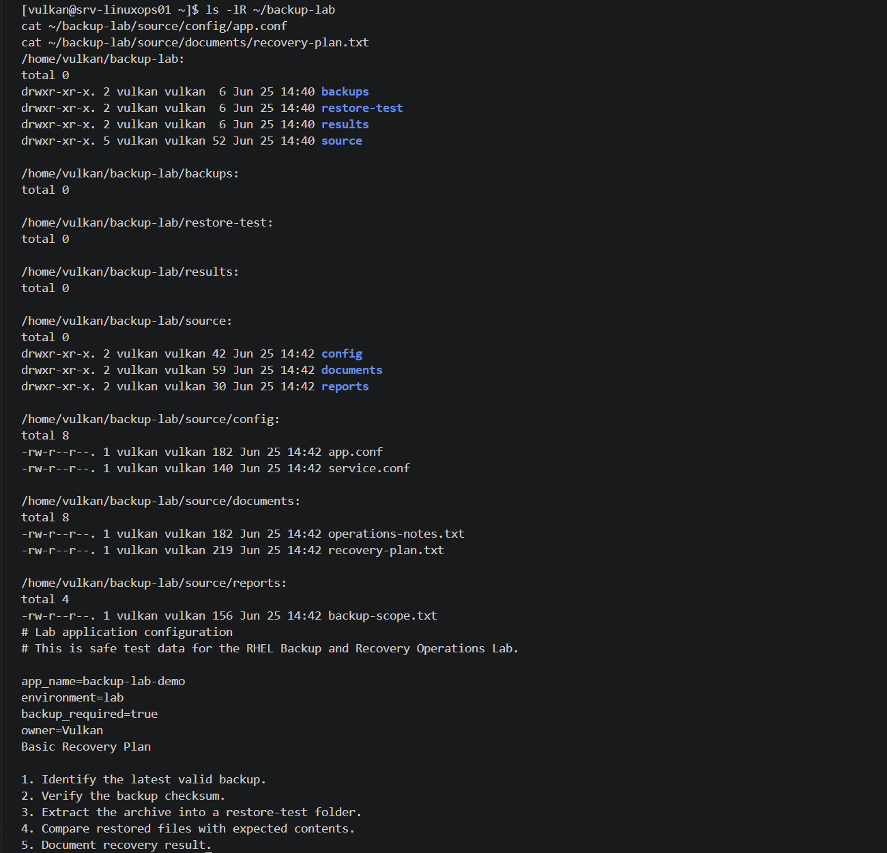
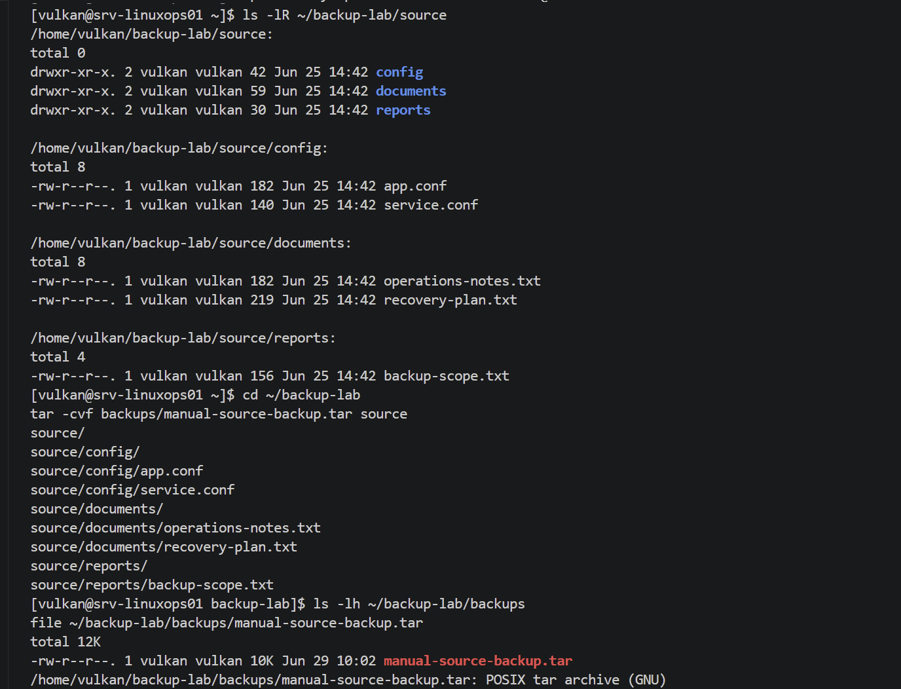
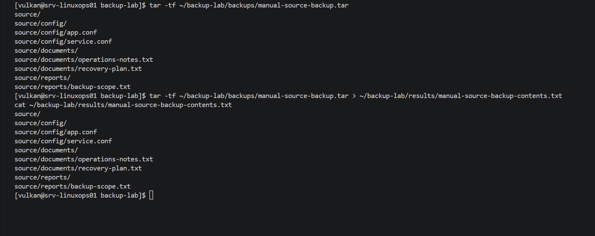
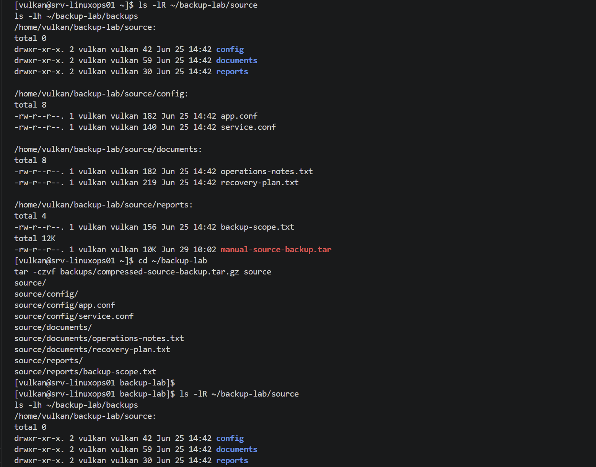
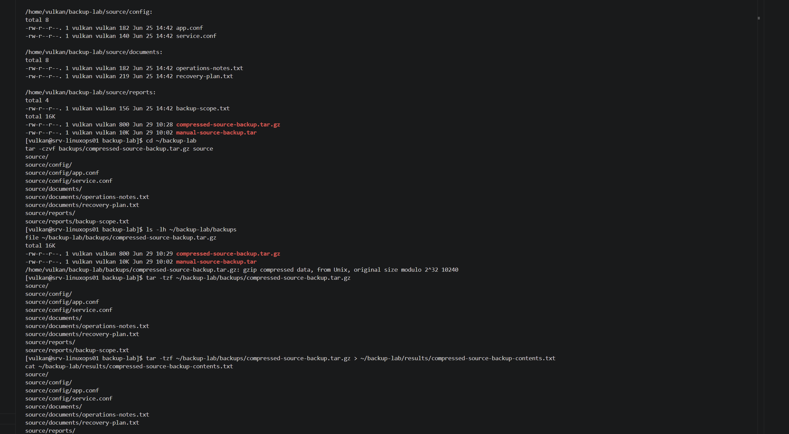
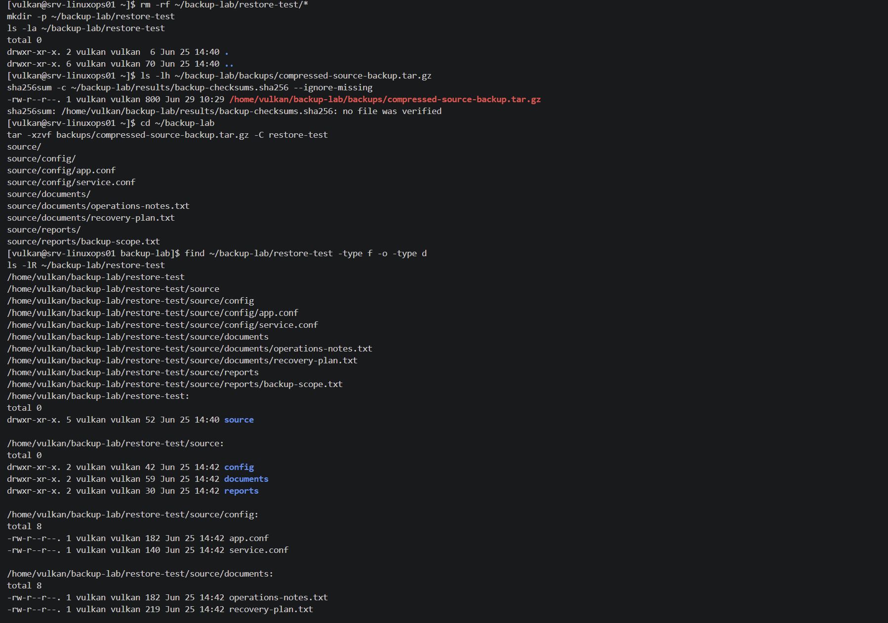
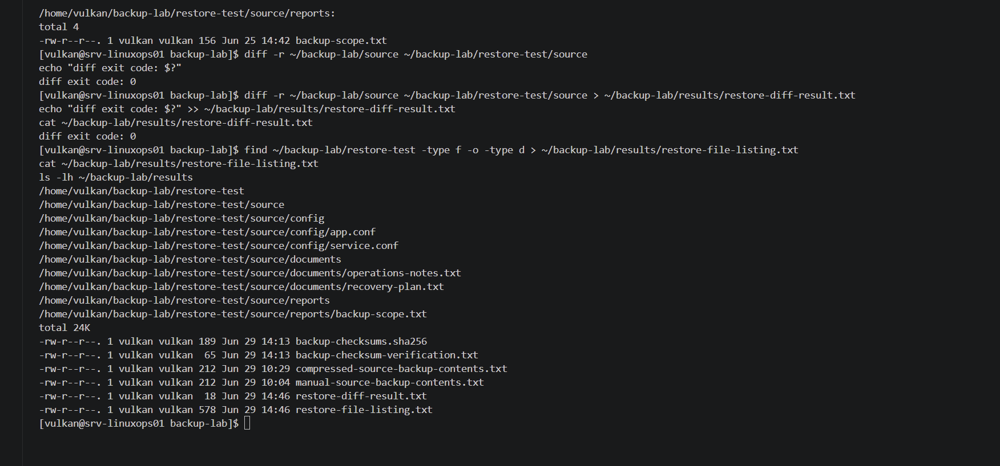

# RHEL Backup and Recovery Operations Lab — Logbook

## 2026-06-25 — Part 1: Repository setup and planning

### Goal

Start the RHEL Backup and Recovery Operations Lab by creating the local project structure, initial documentation files and Git repository.

### Work completed

* Created the local project folder.
* Created the main documentation folders:
  * backups
  * docs
  * screenshots
  * scripts
  * results
* Created `README.md`.
* Created `logbook.md`.
* Created `.gitkeep` files so Git can track empty folders.
* Prepared the project for Git initialization.
* Prepared the project for the first commit.

### Project structure

```text
RHEL-Backup-Recovery-Operations-Lab/
├── backups/
│   └── .gitkeep
├── docs/
│   └── .gitkeep
├── results/
│   └── .gitkeep
├── screenshots/
│   └── .gitkeep
├── scripts/
│   └── .gitkeep
├── logbook.md
└── README.md
```

### Commands used

```powershell
cd C:\Users\rband
mkdir RHEL-Backup-Recovery-Operations-Lab
cd RHEL-Backup-Recovery-Operations-Lab

mkdir docs
mkdir screenshots
mkdir scripts
mkdir results
mkdir backups

New-Item README.md
New-Item logbook.md

New-Item docs\.gitkeep
New-Item screenshots\.gitkeep
New-Item scripts\.gitkeep
New-Item results\.gitkeep
New-Item backups\.gitkeep

code .
```

### Command purpose

| Command                                     | Purpose                                                |
| ------------------------------------------- | ------------------------------------------------------ |
| `cd C:\Users\rband`                         | Moves PowerShell to the user folder.                   |
| `mkdir RHEL-Backup-Recovery-Operations-Lab` | Creates the main project folder.                       |
| `cd RHEL-Backup-Recovery-Operations-Lab`    | Moves into the project folder.                         |
| `mkdir docs`                                | Creates the documentation folder.                      |
| `mkdir screenshots`                         | Creates the screenshot evidence folder.                |
| `mkdir scripts`                             | Creates the script storage folder.                     |
| `mkdir results`                             | Creates the command output and result storage folder.  |
| `mkdir backups`                             | Creates the folder for small lab backup examples.      |
| `New-Item README.md`                        | Creates the main README file.                          |
| `New-Item logbook.md`                       | Creates the project logbook file.                      |
| `New-Item .gitkeep`                         | Creates placeholder files so Git tracks empty folders. |
| `code .`                                    | Opens the current project folder in VS Code.           |

### Notes

This part creates the documentation base for the backup and recovery lab.

The project will continue with RHEL baseline verification and backup tool review before test data or backup archives are created.

Only safe lab data should be used in this project. No real secrets, credentials, private files or production data should be included.

### Evidence

Screenshot:


---

## 2026-06-25 — Part 2: RHEL baseline and backup target review

### Goal

Verify the RHEL server baseline and review available backup tools, scheduling options and possible backup target locations before creating any backup test data.

### Work completed

* Verified the server hostname and system information.
* Verified the current user.
* Verified the installed RHEL version.
* Reviewed current date, time and uptime.
* Reviewed disk usage.
* Reviewed memory and swap usage.
* Reviewed SELinux mode.
* Reviewed firewalld service status.
* Checked whether `tar` is available.
* Checked whether `gzip` is available.
* Checked whether `sha256sum` is available.
* Checked whether `rsync` is available.
* Checked whether the current user has a crontab.
* Reviewed available systemd timers.
* Reviewed the current home directory.
* Confirmed that no existing `~/backup-lab` folder was present.
* Reviewed `/tmp` and `/var/tmp` as temporary storage locations.
* Saved screenshot evidence of the baseline and backup tool review.

### Verification results

| Item                    | Result                            |
| ----------------------- | --------------------------------- |
| RHEL baseline           | Reviewed                          |
| Current user            | `vulkan`                          |
| Disk usage              | Reviewed with `df -h`             |
| Memory usage            | Reviewed with `free -h`           |
| SELinux mode            | Reviewed with `getenforce`        |
| firewalld status        | Reviewed with `systemctl status`  |
| `tar`                   | Available                         |
| `gzip`                  | Available                         |
| `sha256sum`             | Available                         |
| `rsync`                 | Not installed / command not found |
| User crontab            | No user crontab found             |
| systemd timers          | Available and listed              |
| Existing `~/backup-lab` | Not found                         |
| `/tmp`                  | Available                         |
| `/var/tmp`              | Available                         |

### Commands used

```bash
hostnamectl
whoami
cat /etc/os-release
date
uptime

df -h
free -h
getenforce
sudo systemctl status firewalld --no-pager

tar --version
gzip --version
sha256sum --version
rsync --version
crontab -l 2>/dev/null || echo "No user crontab found"
systemctl list-timers --all --no-pager | head -20

pwd
ls -la ~
ls -ld ~/backup-lab 2>/dev/null || echo "No existing backup-lab folder found"
ls -ld /tmp
ls -ld /var/tmp
```

### Command purpose

| Command                                                    | Purpose                                                                |
| ---------------------------------------------------------- | ---------------------------------------------------------------------- |
| `hostnamectl`                                              | Shows hostname, operating system, kernel and architecture information. |
| `whoami`                                                   | Shows the currently logged-in user.                                    |
| `cat /etc/os-release`                                      | Displays the installed Linux distribution and version details.         |
| `date`                                                     | Shows the current system date and time.                                |
| `uptime`                                                   | Shows system uptime and load information.                              |
| `df -h`                                                    | Shows disk usage in human-readable format.                             |
| `free -h`                                                  | Shows memory and swap usage in human-readable format.                  |
| `getenforce`                                               | Shows the current SELinux mode.                                        |
| `sudo systemctl status firewalld --no-pager`               | Shows whether firewalld is loaded and running.                         |
| `tar --version`                                            | Checks whether the `tar` archive tool is available.                    |
| `gzip --version`                                           | Checks whether the `gzip` compression tool is available.               |
| `sha256sum --version`                                      | Checks whether checksum verification is available.                     |
| `rsync --version`                                          | Checks whether `rsync` is available.                                   |
| `crontab -l 2>/dev/null \|\| echo "No user crontab found"` | Checks whether the current user has cron jobs configured.              |
| `systemctl list-timers --all --no-pager \| head -20`       | Lists available systemd timers.                                        |
| `pwd`                                                      | Prints the current working directory.                                  |
| `ls -la ~`                                                 | Lists files and folders in the user home directory.                    |
| `ls -ld ~/backup-lab 2>/dev/null \|\| echo ...`            | Checks whether the backup lab folder already exists.                   |
| `ls -ld /tmp`                                              | Shows permissions and ownership for `/tmp`.                            |
| `ls -ld /var/tmp`                                          | Shows permissions and ownership for `/var/tmp`.                        |

### Notes

The baseline review confirmed the current RHEL server state before any backup test data or backup folders were created.

The system has the required basic tools for this lab: `tar`, `gzip` and `sha256sum`.

The `rsync` command was not available. This was documented as a limitation. The lab can still continue because `tar`, `gzip` and `sha256sum` are enough for archive creation, compression and backup integrity verification.

No user crontab was found. This gives a clean starting point for later scheduled backup review.

systemd timers were available and listed, which provides another scheduling review point later in the lab.

The `~/backup-lab` folder did not already exist. This means the backup lab folder can be created cleanly in the next part.

### Evidence

Screenshots:


---

## 2026-06-25 — Part 3: Create test data and backup source folders

### Goal

Create a safe backup lab folder structure and test data for future backup and restore operations.

The test files are used only for lab purposes and do not contain real secrets, credentials, personal data or production files.

### Work completed

* Created `/home/vulkan/backup-lab`.
* Created a `source` folder for backup source data.
* Created a `source/config` folder for lab configuration files.
* Created a `source/documents` folder for lab document files.
* Created a `source/reports` folder for lab report files.
* Created a `backups` folder for future backup archives.
* Created a `restore-test` folder for future restore testing.
* Created a `results` folder for future checksum and verification output.
* Created safe test configuration files.
* Created safe test document files.
* Created a safe backup scope report.
* Verified the folder structure with `find`.
* Verified file permissions and file contents.
* Saved screenshot evidence.

### Verification results

| Item                  | Result                            |
| --------------------- | --------------------------------- |
| Main lab folder        | `/home/vulkan/backup-lab`         |
| Backup source folder   | `/home/vulkan/backup-lab/source`  |
| Config test files      | Created                           |
| Document test files    | Created                           |
| Report test files      | Created                           |
| Backup archive folder  | Created                           |
| Restore test folder    | Created                           |
| Results folder         | Created                           |
| Real secrets included  | No                                |
| Personal data included | No                                |
| Production files used  | No                                |

### Commands used

```bash
mkdir -p ~/backup-lab/source/config
mkdir -p ~/backup-lab/source/documents
mkdir -p ~/backup-lab/source/reports
mkdir -p ~/backup-lab/backups
mkdir -p ~/backup-lab/restore-test
mkdir -p ~/backup-lab/results

cat > ~/backup-lab/source/config/app.conf <<'EOF'
# Lab application configuration
# This is safe test data for the RHEL Backup and Recovery Operations Lab.

app_name=backup-lab-demo
environment=lab
backup_required=true
owner=Vulkan
EOF

cat > ~/backup-lab/source/config/service.conf <<'EOF'
# Lab service configuration
# No real secrets are stored in this file.

service_name=example-service
service_port=8080
service_enabled=true
EOF

cat > ~/backup-lab/source/documents/operations-notes.txt <<'EOF'
RHEL Backup and Recovery Operations Lab

This document represents safe operational notes for backup testing.

No real business data, credentials, keys or personal data are included.
EOF

cat > ~/backup-lab/source/documents/recovery-plan.txt <<'EOF'
Basic Recovery Plan

1. Identify the latest valid backup.
2. Verify the backup checksum.
3. Extract the archive into a restore-test folder.
4. Compare restored files with expected contents.
5. Document recovery result.
EOF

cat > ~/backup-lab/source/reports/backup-scope.txt <<'EOF'
Backup Scope

Included:
- Lab configuration files
- Lab documents
- Lab reports

Excluded:
- Real credentials
- SSH keys
- Personal data
- Production files
EOF

tree ~/backup-lab 2>/dev/null || find ~/backup-lab -type f -o -type d

ls -lR ~/backup-lab
cat ~/backup-lab/source/config/app.conf
cat ~/backup-lab/source/documents/recovery-plan.txt
```

### Command purpose

| Command                                               | Purpose                                                        |
| ----------------------------------------------------- | -------------------------------------------------------------- |
| `mkdir -p`                                            | Creates folders and parent folders if needed.                  |
| `cat > file <<'EOF'`                                  | Creates a text file using heredoc input.                       |
| `tree ~/backup-lab 2>/dev/null \|\| find ...`         | Shows the folder structure, using `find` if `tree` is missing. |
| `ls -lR ~/backup-lab`                                 | Lists files and folders recursively with permissions.          |
| `cat ~/backup-lab/source/config/app.conf`             | Shows the test application configuration file content.         |
| `cat ~/backup-lab/source/documents/recovery-plan.txt` | Shows the test recovery plan file content.                     |

### Notes

The backup lab structure was created under the `vulkan` user home directory.

The source folder contains safe test data only. The files are intentionally fake and contain no real credentials, SSH keys, personal data or production information.

The folder structure includes separate areas for backup source data, backup archives, restore testing and result output. This makes later backup and recovery steps easier to document clearly.

The `tree` command was not required because the fallback `find` command successfully listed the folder structure.

### Evidence

Screenshots:





---

## 2026-06-25 — Part 4: Manual tar backup

### Goal

Create a manual tar backup archive from the safe backup test data and verify that the archive exists and contains the expected files.

### Work completed

* Reviewed the backup source folder.
* Created a manual tar archive from `/home/vulkan/backup-lab/source`.
* Saved the archive in `/home/vulkan/backup-lab/backups`.
* Verified that the archive file was created.
* Verified the archive file type.
* Listed the archive contents without extracting it.
* Saved the archive content listing to a results file.
* Saved screenshot evidence.

### Verification results

| Item                  | Result                                                              |
| --------------------- | ------------------------------------------------------------------- |
| Backup source folder  | `/home/vulkan/backup-lab/source`                                    |
| Backup archive folder | `/home/vulkan/backup-lab/backups`                                   |
| Archive file          | `/home/vulkan/backup-lab/backups/manual-source-backup.tar`          |
| Archive type          | tar archive                                                         |
| Archive contents      | Verified with `tar -tf`                                             |
| Results file          | `/home/vulkan/backup-lab/results/manual-source-backup-contents.txt` |

### Commands used

```bash
ls -lR ~/backup-lab/source

cd ~/backup-lab
tar -cvf backups/manual-source-backup.tar source

ls -lh ~/backup-lab/backups
file ~/backup-lab/backups/manual-source-backup.tar

tar -tf ~/backup-lab/backups/manual-source-backup.tar

tar -tf ~/backup-lab/backups/manual-source-backup.tar > ~/backup-lab/results/manual-source-backup-contents.txt
cat ~/backup-lab/results/manual-source-backup-contents.txt
```

### Command purpose

| Command                                                      | Purpose                                                   |
| ------------------------------------------------------------ | --------------------------------------------------------- |
| `ls -lR ~/backup-lab/source`                                 | Lists the backup source files recursively before backup.  |
| `cd ~/backup-lab`                                            | Moves into the main backup lab folder.                    |
| `tar -cvf backups/manual-source-backup.tar source`           | Creates a manual tar archive from the `source` folder.    |
| `ls -lh ~/backup-lab/backups`                                | Verifies that the archive exists and shows its file size. |
| `file ~/backup-lab/backups/manual-source-backup.tar`         | Checks the archive file type.                             |
| `tar -tf ~/backup-lab/backups/manual-source-backup.tar`      | Lists the archive contents without extracting it.         |
| `> ~/backup-lab/results/manual-source-backup-contents.txt`   | Saves the archive content listing to a results file.      |
| `cat ~/backup-lab/results/manual-source-backup-contents.txt` | Displays the saved archive content listing.               |

### Notes

This part created an uncompressed tar archive. This is useful for learning basic archive creation before moving on to compressed backups.

The archive contains only safe lab test data from the backup source folder.

The archive was verified without extraction by listing its contents with `tar -tf`.

The archive content listing was saved in the `results` folder so the backup contents can be reviewed later without rerunning the command.

### Evidence

Screenshots:





---

## 2026-06-25 — Part 5: Compressed backup archive

### Goal

Create a compressed backup archive from the safe backup test data and verify that the archive exists, has the correct file type and contains the expected files.

### Work completed

* Reviewed the backup source folder.
* Reviewed the existing backup archive folder.
* Created a compressed `tar.gz` archive from `/home/vulkan/backup-lab/source`.
* Saved the compressed archive in `/home/vulkan/backup-lab/backups`.
* Verified that the compressed archive file was created.
* Verified the compressed archive file type.
* Listed the compressed archive contents without extracting it.
* Saved the compressed archive content listing to a results file.
* Saved screenshot evidence.

### Verification results

| Item                       | Result                                                                  |
| -------------------------- | ----------------------------------------------------------------------- |
| Backup source folder       | `/home/vulkan/backup-lab/source`                                        |
| Backup archive folder      | `/home/vulkan/backup-lab/backups`                                       |
| Compressed archive file    | `/home/vulkan/backup-lab/backups/compressed-source-backup.tar.gz`       |
| Archive type               | gzip-compressed tar archive                                             |
| Archive contents           | Verified with `tar -tzf`                                                |
| Results file               | `/home/vulkan/backup-lab/results/compressed-source-backup-contents.txt` |
| Previous uncompressed file | `/home/vulkan/backup-lab/backups/manual-source-backup.tar`              |

### Commands used

```bash
ls -lR ~/backup-lab/source
ls -lh ~/backup-lab/backups

cd ~/backup-lab
tar -czvf backups/compressed-source-backup.tar.gz source

ls -lh ~/backup-lab/backups
file ~/backup-lab/backups/compressed-source-backup.tar.gz

tar -tzf ~/backup-lab/backups/compressed-source-backup.tar.gz

tar -tzf ~/backup-lab/backups/compressed-source-backup.tar.gz > ~/backup-lab/results/compressed-source-backup-contents.txt
cat ~/backup-lab/results/compressed-source-backup-contents.txt
```

### Command purpose

| Command                                                          | Purpose                                                                |
| ---------------------------------------------------------------- | ---------------------------------------------------------------------- |
| `ls -lR ~/backup-lab/source`                                     | Lists the backup source files recursively before creating the archive. |
| `ls -lh ~/backup-lab/backups`                                    | Reviews existing backup archives and their readable file sizes.        |
| `cd ~/backup-lab`                                                | Moves into the main backup lab folder.                                 |
| `tar -czvf backups/compressed-source-backup.tar.gz source`       | Creates a gzip-compressed tar archive from the `source` folder.        |
| `ls -lh ~/backup-lab/backups`                                    | Verifies that the compressed archive exists and shows its file size.   |
| `file ~/backup-lab/backups/compressed-source-backup.tar.gz`      | Checks the compressed archive file type.                               |
| `tar -tzf ~/backup-lab/backups/compressed-source-backup.tar.gz`  | Lists the compressed archive contents without extracting it.           |
| `> ~/backup-lab/results/compressed-source-backup-contents.txt`   | Saves the compressed archive content listing to a results file.        |
| `cat ~/backup-lab/results/compressed-source-backup-contents.txt` | Displays the saved compressed archive content listing.                 |

### Notes

This part created a compressed backup archive using the `tar -z` option for gzip compression.

The compressed archive contains only safe lab test data from the backup source folder.

The archive was verified without extraction by listing its contents with `tar -tzf`.

The archive content listing was saved in the `results` folder so the compressed backup contents can be reviewed later without rerunning the command.

### Evidence

Screenshots:





---

## 2026-06-29 — Part 6: Backup verification and checksums

### Goal

Generate SHA-256 checksums for the backup archives and verify that the archives match their recorded checksum values.

### Work completed

* Reviewed the backup archive folder.
* Verified the manual tar archive file type.
* Verified the compressed tar.gz archive file type.
* Generated SHA-256 checksums for both backup archives.
* Saved the checksum hashes to a results file.
* Verified both backup archives with `sha256sum -c`.
* Saved the checksum verification output to a results file.
* Reviewed the results folder.
* Saved screenshot evidence.

### Verification results

| Item                            | Result                                                             |
| ------------------------------- | ------------------------------------------------------------------ |
| Manual backup archive           | `/home/vulkan/backup-lab/backups/manual-source-backup.tar`         |
| Compressed backup archive       | `/home/vulkan/backup-lab/backups/compressed-source-backup.tar.gz`  |
| Checksum file                   | `/home/vulkan/backup-lab/results/backup-checksums.sha256`          |
| Checksum verification file      | `/home/vulkan/backup-lab/results/backup-checksum-verification.txt` |
| Manual archive verification     | `OK`                                                               |
| Compressed archive verification | `OK`                                                               |

### Commands used

```bash
ls -lh ~/backup-lab/backups
file ~/backup-lab/backups/manual-source-backup.tar
file ~/backup-lab/backups/compressed-source-backup.tar.gz

cd ~/backup-lab/backups
sha256sum manual-source-backup.tar compressed-source-backup.tar.gz > ../results/backup-checksums.sha256
cat ../results/backup-checksums.sha256

sha256sum -c ../results/backup-checksums.sha256

sha256sum -c ../results/backup-checksums.sha256 > ../results/backup-checksum-verification.txt
cat ../results/backup-checksum-verification.txt

ls -lh ~/backup-lab/results
```

### Command purpose

| Command                                                              | Purpose                                                   |
| -------------------------------------------------------------------- | --------------------------------------------------------- |
| `ls -lh ~/backup-lab/backups`                                        | Lists backup archives and shows readable file sizes.      |
| `file ~/backup-lab/backups/manual-source-backup.tar`                 | Checks the file type of the manual tar archive.           |
| `file ~/backup-lab/backups/compressed-source-backup.tar.gz`          | Checks the file type of the compressed archive.           |
| `cd ~/backup-lab/backups`                                            | Moves into the backup archive folder.                     |
| `sha256sum manual-source-backup.tar compressed-source-backup.tar.gz` | Generates SHA-256 checksums for both backup archives.     |
| `> ../results/backup-checksums.sha256`                               | Saves the checksum output to a results file.              |
| `cat ../results/backup-checksums.sha256`                             | Displays the saved checksum file.                         |
| `sha256sum -c ../results/backup-checksums.sha256`                    | Verifies the backup archives against the checksum file.   |
| `> ../results/backup-checksum-verification.txt`                      | Saves the checksum verification output to a results file. |
| `cat ../results/backup-checksum-verification.txt`                    | Displays the saved checksum verification result.          |
| `ls -lh ~/backup-lab/results`                                        | Lists saved result files.                                 |

### Notes

The checksum file records SHA-256 hashes for both backup archives.

The verification command returned `OK` for both backup archives, confirming that the files matched their recorded checksum values.

This step helps prove backup integrity and provides a way to detect future corruption or unexpected file changes.

### Evidence

Screenshots:


---

## 2026-06-29 — Part 7: Restore test from backup

### Goal

Restore the compressed backup archive into a separate restore test folder and verify that the restored files match the original source files.

### Work completed

* Cleared the restore test folder.
* Verified the backup checksums before restoring.
* Extracted the compressed backup archive into `/home/vulkan/backup-lab/restore-test`.
* Verified the restored folder structure.
* Listed restored files and folders.
* Compared the restored source folder with the original source folder.
* Confirmed that the restore comparison returned exit code `0`.
* Saved the restore comparison result to a results file.
* Saved the restored file listing to a results file.
* Saved screenshot evidence.

### Verification results

| Item                       | Result                                                            |
| -------------------------- | ----------------------------------------------------------------- |
| Backup archive restored    | `/home/vulkan/backup-lab/backups/compressed-source-backup.tar.gz` |
| Restore destination        | `/home/vulkan/backup-lab/restore-test`                            |
| Original source folder     | `/home/vulkan/backup-lab/source`                                  |
| Restored source folder     | `/home/vulkan/backup-lab/restore-test/source`                     |
| Checksum verification      | `OK`                                                              |
| Restore comparison command | `diff -r`                                                         |
| Restore comparison result  | `diff exit code: 0`                                               |
| Restore diff result file   | `/home/vulkan/backup-lab/results/restore-diff-result.txt`         |
| Restore file listing       | `/home/vulkan/backup-lab/results/restore-file-listing.txt`        |

### Commands used

```bash
rm -rf ~/backup-lab/restore-test/*
mkdir -p ~/backup-lab/restore-test
ls -la ~/backup-lab/restore-test

cd ~/backup-lab/backups
sha256sum -c ../results/backup-checksums.sha256

cd ~/backup-lab
tar -xzvf backups/compressed-source-backup.tar.gz -C restore-test

find ~/backup-lab/restore-test -type f -o -type d
ls -lR ~/backup-lab/restore-test

diff -r ~/backup-lab/source ~/backup-lab/restore-test/source
echo "diff exit code: $?"

diff -r ~/backup-lab/source ~/backup-lab/restore-test/source > ~/backup-lab/results/restore-diff-result.txt
echo "diff exit code: $?" >> ~/backup-lab/results/restore-diff-result.txt
cat ~/backup-lab/results/restore-diff-result.txt

find ~/backup-lab/restore-test -type f -o -type d > ~/backup-lab/results/restore-file-listing.txt
cat ~/backup-lab/results/restore-file-listing.txt
ls -lh ~/backup-lab/results
```

### Command purpose

| Command                                                                            | Purpose                                                       |
| ---------------------------------------------------------------------------------- | ------------------------------------------------------------- |
| `rm -rf ~/backup-lab/restore-test/*`                                               | Clears old restore test contents.                             |
| `mkdir -p ~/backup-lab/restore-test`                                               | Ensures the restore test folder exists.                       |
| `ls -la ~/backup-lab/restore-test`                                                 | Shows the restore test folder before extraction.              |
| `cd ~/backup-lab/backups`                                                          | Moves into the backup archive folder.                         |
| `sha256sum -c ../results/backup-checksums.sha256`                                  | Verifies backup archives before restore testing.              |
| `cd ~/backup-lab`                                                                  | Moves into the main backup lab folder.                        |
| `tar -xzvf backups/compressed-source-backup.tar.gz -C restore-test`                 | Extracts the compressed archive into the restore test folder. |
| `find ~/backup-lab/restore-test -type f -o -type d`                                | Lists restored files and folders.                             |
| `ls -lR ~/backup-lab/restore-test`                                                 | Lists restored files recursively with permissions.            |
| `diff -r ~/backup-lab/source ~/backup-lab/restore-test/source`                     | Compares the original source folder with the restored folder. |
| `echo "diff exit code: $?"`                                                        | Shows the result code from the comparison command.            |
| `> ~/backup-lab/results/restore-diff-result.txt`                                   | Saves the restore comparison output to a results file.        |
| `cat ~/backup-lab/results/restore-diff-result.txt`                                 | Displays the saved restore comparison result.                 |
| `find ~/backup-lab/restore-test -type f -o -type d > .../restore-file-listing.txt` | Saves the restored file listing to a results file.            |
| `cat ~/backup-lab/results/restore-file-listing.txt`                                | Displays the saved restored file listing.                     |
| `ls -lh ~/backup-lab/results`                                                      | Lists saved result files.                                     |

### Notes

The restore test confirmed that the compressed backup archive could be extracted successfully.

The restored files were compared against the original source files using `diff -r`.

The comparison returned `diff exit code: 0`, which means no differences were found between the original source folder and the restored source folder.

This confirms that the backup archive was usable for recovery, not just archive creation.

### Evidence

Screenshots:





---

## 2026-06-29 — Final project wrap-up

### Goal

Close the RHEL Backup and Recovery Operations Lab as a completed basic backup and restore workflow.

### Work completed

* Reviewed the completed lab parts.
* Confirmed that the project covers the full basic backup lifecycle.
* Confirmed that backup archives were created.
* Confirmed that checksum verification was completed.
* Confirmed that restore testing was completed successfully.
* Confirmed that restored files matched the original source files.
* Decided to stop the project after restore verification.
* Documented possible future improvements instead of continuing into more advanced scripting and scheduling tasks.

### Completed workflow

| Area | Result |
| --- | --- |
| Repository setup | Complete |
| RHEL baseline review | Complete |
| Test data creation | Complete |
| Manual backup archive | Complete |
| Compressed backup archive | Complete |
| Checksum verification | Complete |
| Restore test | Complete |
| GitHub documentation | Complete |
| Backup scripting | Future improvement |
| Scheduled backup automation | Future improvement |

### Notes

The project is completed as a basic RHEL backup and recovery operations lab.

The lab successfully demonstrates the core backup workflow:

1. Prepare safe test data.
2. Create backup archives.
3. Verify backup contents.
4. Generate and verify checksums.
5. Restore from backup.
6. Compare restored files against the original source files.
7. Document the process with screenshots and Git commits.

The project stops here because the main learning goal has been reached. More advanced automation tasks, such as backup scripts and scheduled jobs, can be added later as future improvements.

This keeps the project realistic, focused and suitable for a portfolio.
