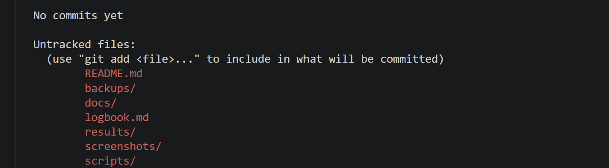
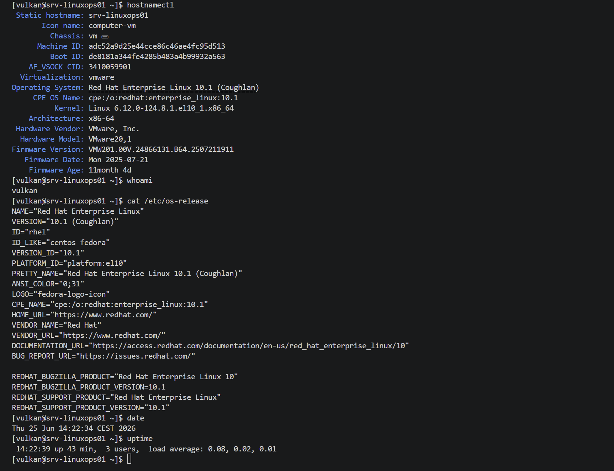
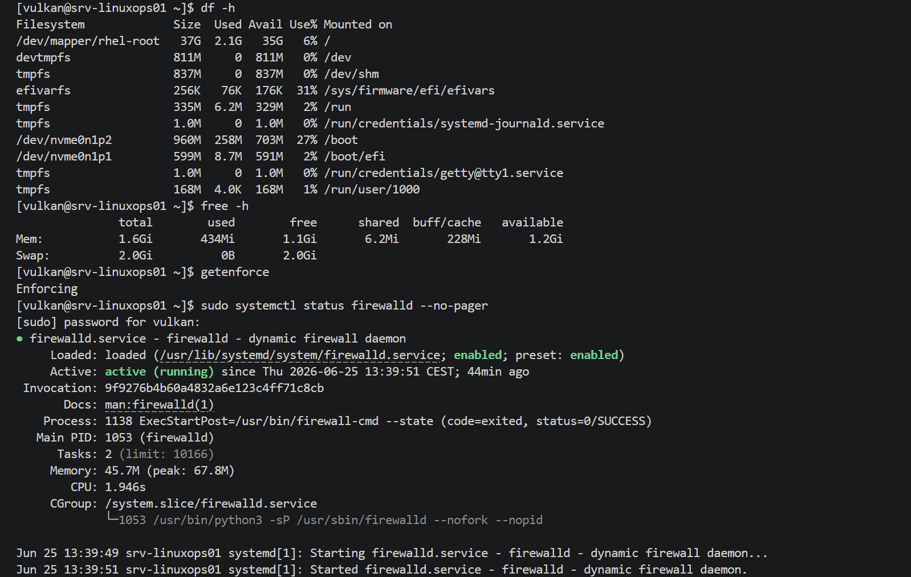
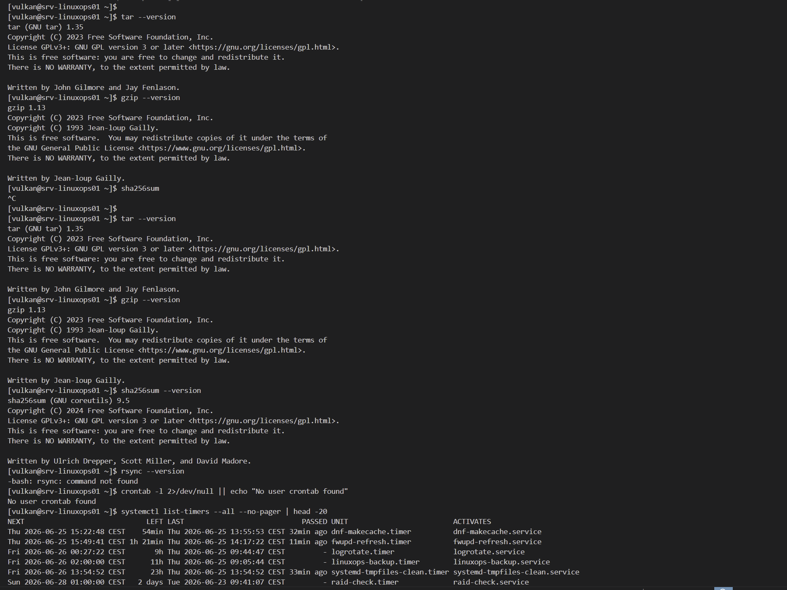
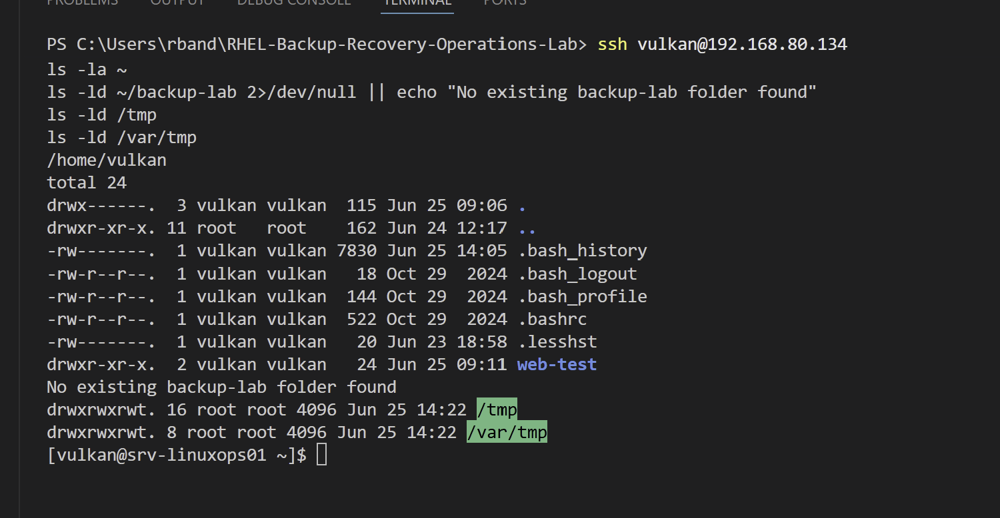

# RHEL Backup and Recovery Operations Lab — Logbook

## 2026-06-25 — Part 1: Repository setup and planning

### Goal

Start the RHEL Backup and Recovery Operations Lab by creating the local project structure, initial documentation files and Git repository.

### Work completed

* Created the local project folder.
* Created the main documentation folders:

  * backups
  * docs
  * screenshots
  * scripts
  * results
* Created `README.md`.
* Created `logbook.md`.
* Created `.gitkeep` files so Git can track empty folders.
* Prepared the project for Git initialization.
* Prepared the project for the first commit.

### Project structure

```text
RHEL-Backup-Recovery-Operations-Lab/
├── backups/
│   └── .gitkeep
├── docs/
│   └── .gitkeep
├── results/
│   └── .gitkeep
├── screenshots/
│   └── .gitkeep
├── scripts/
│   └── .gitkeep
├── logbook.md
└── README.md
```

### Commands used

```powershell
cd C:\Users\rband
mkdir RHEL-Backup-Recovery-Operations-Lab
cd RHEL-Backup-Recovery-Operations-Lab

mkdir docs
mkdir screenshots
mkdir scripts
mkdir results
mkdir backups

New-Item README.md
New-Item logbook.md

New-Item docs\.gitkeep
New-Item screenshots\.gitkeep
New-Item scripts\.gitkeep
New-Item results\.gitkeep
New-Item backups\.gitkeep

code .
```

### Command purpose

| Command                                     | Purpose                                                |
| ------------------------------------------- | ------------------------------------------------------ |
| `cd C:\Users\rband`                         | Moves PowerShell to the user folder.                   |
| `mkdir RHEL-Backup-Recovery-Operations-Lab` | Creates the main project folder.                       |
| `cd RHEL-Backup-Recovery-Operations-Lab`    | Moves into the project folder.                         |
| `mkdir docs`                                | Creates the documentation folder.                      |
| `mkdir screenshots`                         | Creates the screenshot evidence folder.                |
| `mkdir scripts`                             | Creates the script storage folder.                     |
| `mkdir results`                             | Creates the command output and result storage folder.  |
| `mkdir backups`                             | Creates the folder for small lab backup examples.      |
| `New-Item README.md`                        | Creates the main README file.                          |
| `New-Item logbook.md`                       | Creates the project logbook file.                      |
| `New-Item .gitkeep`                         | Creates placeholder files so Git tracks empty folders. |
| `code .`                                    | Opens the current project folder in VS Code.           |

### Notes

This part creates the documentation base for the backup and recovery lab.

The project will continue with RHEL baseline verification and backup tool review before test data or backup archives are created.

Only safe lab data should be used in this project. No real secrets, credentials, private files or production data should be included.

### Evidence

Screenshot:



---

## 2026-06-25 — Part 2: RHEL baseline and backup target review

### Goal

Verify the RHEL server baseline and review available backup tools, scheduling options and possible backup target locations before creating any backup test data.

### Work completed

* Verified the server hostname and system information.
* Verified the current user.
* Verified the installed RHEL version.
* Reviewed current date, time and uptime.
* Reviewed disk usage.
* Reviewed memory and swap usage.
* Reviewed SELinux mode.
* Reviewed firewalld service status.
* Checked whether `tar` is available.
* Checked whether `gzip` is available.
* Checked whether `sha256sum` is available.
* Checked whether `rsync` is available.
* Checked whether the current user has a crontab.
* Reviewed available systemd timers.
* Reviewed the current home directory.
* Confirmed that no existing `~/backup-lab` folder was present.
* Reviewed `/tmp` and `/var/tmp` as temporary storage locations.
* Saved screenshot evidence of the baseline and backup tool review.

### Verification results

| Item                    | Result                            |
| ----------------------- | --------------------------------- |
| RHEL baseline           | Reviewed                          |
| Current user            | `vulkan`                          |
| Disk usage              | Reviewed with `df -h`             |
| Memory usage            | Reviewed with `free -h`           |
| SELinux mode            | Reviewed with `getenforce`        |
| firewalld status        | Reviewed with `systemctl status`  |
| `tar`                   | Available                         |
| `gzip`                  | Available                         |
| `sha256sum`             | Available                         |
| `rsync`                 | Not installed / command not found |
| User crontab            | No user crontab found             |
| systemd timers          | Available and listed              |
| Existing `~/backup-lab` | Not found                         |
| `/tmp`                  | Available                         |
| `/var/tmp`              | Available                         |

### Commands used

```bash
hostnamectl
whoami
cat /etc/os-release
date
uptime

df -h
free -h
getenforce
sudo systemctl status firewalld --no-pager

tar --version
gzip --version
sha256sum --version
rsync --version
crontab -l 2>/dev/null || echo "No user crontab found"
systemctl list-timers --all --no-pager | head -20

pwd
ls -la ~
ls -ld ~/backup-lab 2>/dev/null || echo "No existing backup-lab folder found"
ls -ld /tmp
ls -ld /var/tmp
```

### Command purpose

| Command                                                    | Purpose                                                                |
| ---------------------------------------------------------- | ---------------------------------------------------------------------- |
| `hostnamectl`                                              | Shows hostname, operating system, kernel and architecture information. |
| `whoami`                                                   | Shows the currently logged-in user.                                    |
| `cat /etc/os-release`                                      | Displays the installed Linux distribution and version details.         |
| `date`                                                     | Shows the current system date and time.                                |
| `uptime`                                                   | Shows system uptime and load information.                              |
| `df -h`                                                    | Shows disk usage in human-readable format.                             |
| `free -h`                                                  | Shows memory and swap usage in human-readable format.                  |
| `getenforce`                                               | Shows the current SELinux mode.                                        |
| `sudo systemctl status firewalld --no-pager`               | Shows whether firewalld is loaded and running.                         |
| `tar --version`                                            | Checks whether the `tar` archive tool is available.                    |
| `gzip --version`                                           | Checks whether the `gzip` compression tool is available.               |
| `sha256sum --version`                                      | Checks whether checksum verification is available.                     |
| `rsync --version`                                          | Checks whether `rsync` is available.                                   |
| `crontab -l 2>/dev/null \|\| echo "No user crontab found"` | Checks whether the current user has cron jobs configured.              |
| `systemctl list-timers --all --no-pager \| head -20`       | Lists available systemd timers.                                        |
| `pwd`                                                      | Prints the current working directory.                                  |
| `ls -la ~`                                                 | Lists files and folders in the user home directory.                    |
| `ls -ld ~/backup-lab 2>/dev/null \|\| echo ...`            | Checks whether the backup lab folder already exists.                   |
| `ls -ld /tmp`                                              | Shows permissions and ownership for `/tmp`.                            |
| `ls -ld /var/tmp`                                          | Shows permissions and ownership for `/var/tmp`.                        |

### Notes

The baseline review confirmed the current RHEL server state before any backup test data or backup folders were created.

The system has the required basic tools for this lab: `tar`, `gzip` and `sha256sum`.

The `rsync` command was not available. This was documented as a limitation. The lab can still continue because `tar`, `gzip` and `sha256sum` are enough for archive creation, compression and backup integrity verification.

No user crontab was found. This gives a clean starting point for later scheduled backup review.

systemd timers were available and listed, which provides another scheduling review point later in the lab.

The `~/backup-lab` folder did not already exist. This means the backup lab folder can be created cleanly in the next part.

### Evidence

Screenshots:








